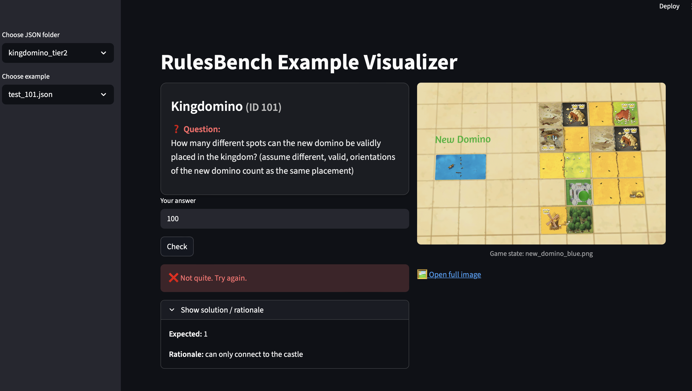

## LudoBench Visualizer

This `src` folder contains the **LudoBench Visualizer** — a Streamlit tool to help you explore the annotation dataset interactively.

###  Setup

To run it locally:

1. **Create and activate a virtual environment** (optional but recommended):
   
   python3 -m venv .venv

   source .venv/bin/activate   # Mac/Linux
   
   .venv\Scripts\activate      # Windows

2. Install dependencies:

    pip install streamlit pillow requests

3. Finally run the visualiser:

    streamlit run src/visualize_dataset.py -- --folder ./annotation_data_blanked

  
   
  <em>Example of the LudoBench Visualizer interface</em>

